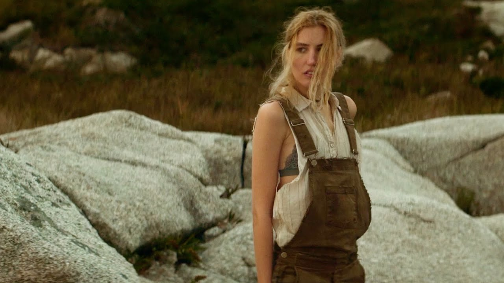

+++
title = "Two Films on Catastrophe"
author = ["Rick Wysocki"]
date = 2022-01-05T00:00:00-05:00
tags = ["film"]
draft = false
summary = "Last night I watched Nicholas Ashe Bateman's The Wanting Mare and Adam McKay's Don't Look Up. Each suggests a similar conclusion-in a senseless world, codependence is the only way to find meaning."
+++

Last night I watched two apocalyptic films. Both Nicholas Ashe Bateman's
_The Wanting Mare_ and Adam McKay's _Don't Look Up_ note that the world
seems to be moving toward catastrophe. While the _The Wanting Mare_
imagines an ambiguous future in a fantastical post-apocalyptic city,
_Don't Look Up_ satirically reflects our present world in the face of an
incoming comet--a perhaps too-on-the-nose "planet-killer." Neither film
is perfect, but each suggests a similar conclusion: in a senseless
world, codependence is the only way to find meaning.

_The Wanting Mare_ follows a multigenerational family of women who dream
of a world that existed before an unnamed apocalyptic event. Most of the
story takes place in a devastated city called Whithren where wild horses
are caught and exported to another city across the sea called Levithen.
Whithren is devastated, and much of the narrative centers on the curious
detail that is possible to acquire a one-way ticket to Levithen
alongside the horses on an export ship. These tickets are so rare that
the people of Whitren regularly kill and are killed for them.

I'll avoid saying more and spoiling the plot. Described in quite a few
online reviews I read as a "tone poem," _The Wanting Mare_ excels in
_ambiance_. Its insistent and, at times, frustrating lack of both
dialogue and plot exposition makes it difficult to put it into words. (I
learned this in an earlier, much longer draft of this post, from which
I've spared you.)

Against the ambient and labyrinthine style of _The Wanting Mare_, the
aggressive satire in McKay's _Don't Look Up_ (which I watched
immediately after) gave me whiplash. I could practically hear the movie
saying:

> This comet is climate change! Stop ignoring it! Stop letting
> politicians ignore it!

There's value to the political messaging in the movie and its critique
of modern life. And I share many of the perspectives offered in the
movie. But I can't help feeling oversells "how dumb everything is"
(think _Idiocracy,_
[which
is bad](https://www.vice.com/en/article/bn3vgv/idiocracy-is-elitist-porn)) over its more subtle themes. This is always the bargain
involved in turning politics into art, which more often enervates than
accelerates change, and most often has no effect at all.

What's more interesting about _Don't Look Up_ is that throughout nearly
the entire narrative the catastrophic event has not yet occurred. But it
feels so much more determined, so much more possible, than whatever it
is that actually, already destroyed the world in _The Wanting Mare_.
This is largely due to McKay's realism and the directness of the
commentary juxtaposed against the subtle, fantastical, elements
presented by Bateman. And McKay is right: it is difficult to argue
against the dire position we're in.

But Bateman's movie dares to hope and to find hope in human connections,
relationships, and histories. Which is not to say that McKay doesn't get
there as well. Anyone who has watched _Don't Look Up_ knows that there
is only one thing there before "the end." And if you've watched _The
Wanting Mare_ you hope they'll be there after, too.
