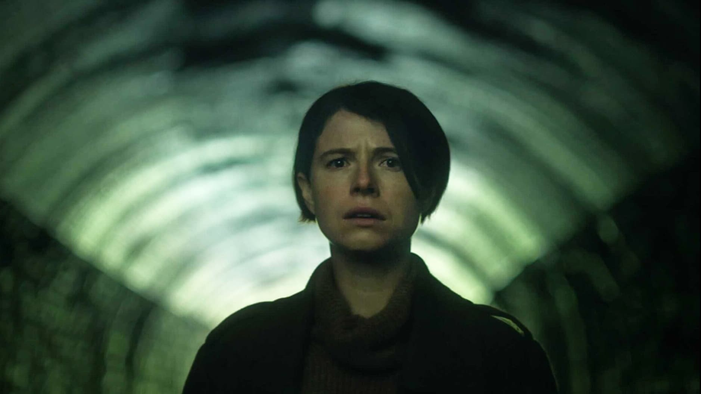

+++
title = "Men (2022)"
author = ["Rick Wysocki"]
date = 2021-06-05T00:00:00-04:00
tags = ["film"]
draft = false
summary = "A few weeks ago, I went to see Alex Garland's film Men. I really enjoyed it, especially in the context of my growing interest in both film genre studies and the specific genre of horror."
+++

A few weeks ago, I went to see Alex Garland's film _Men_. I really enjoyed it, especially in the context of my growing interest in both film genre studies and the specific genre of horror.

Genre is notoriously tricky to pin down as a concept, not least so because it's often referred to in different ways in different conversations. I take genre as a category that influences the expectations of the producers and receivers of art. Genre affects how filmmakers structure their work and what audiences should expect from that work.

Rick Altman wrote in _Film/Genre_ that genres tend to be approached through four operative metaphors:

    as a **blueprint** for industry practices,
    as a **structure** expected by the audience,
    as an industry **label** used to market and communicate the film,
    and as a **contract** of expectations between filmmakers and audiences (14).

Too often, however, critics tend to approach genres in reductive ways. Altman devotes most of his book to identifying and correcting these errors. One of his central concerns is that critics often make sweeping claims about entire genres based on a relatively small collection of films (24). Rather than saying anything about the genre of horror itself, then, I'll just make a few comments about how **Men** repurposes some existing _expectations_ about horror films in interesting ways.

_Men_'s "birthing scene," I imagine is what will linger in most viewers' minds. It feels informed by _Alien,_ which similarly focuses on the grotesque-maternal. Whereas the latter film narrates an external threat (the Alien), _Men_ locates the terrifying presence as interior to human / social masculinity. Barry Langford wrote that horror has largely shifted from an interior to an exterior focus, external terror having lost much of its fright value (178). It's worth noting that he wrote this _before_ the invention of the "A24 Film," which might have taken this interiorization toward its limit.

_Men_ is aware of the expectations viewers bring to a horror picture. Horror films often narrate anxieties related to changing gender roles as well as social difference, more broadly. As Langford noted, horror traditionally reflects an ideological ambiguity, both allowing for the "unmasking" of repressed actions but also the eventual restoration of the "status quo" (159). Vivian Sobchack, similarly, argued that both horror and sci-fi fictionalize "the Other" and the breakdown of the gendered fantasy of the home-as-castle (8). _Men_ certainly seems invested in both of these genre elements.

But the film also departs from horror genre expectations. Harper refuses to carry out her contracted obligation with the audience to murder James with the axe, and this is--frankly--far more interesting than the shock of the birthing scene.

In horror, "normality" is often found by re-integrating monstrous elements (Langford 172); the protagonist usually needs to "become the monster" in order to destroy it. In _Scream V_, for example, Sam's relation to Billy Loomis is revealed and she becomes, herself, righteously murderous.

Juxtapose this against Garland's film. _Men_ introduces the axe early and sets up the expectation that it will be used early in the film. In the end, that expectation is swiftly refused. We see the axe in the first act of the movie and say: "Oh, I know where this will go: This is a horror movie, and somebody is going to get axed." Instead, at the end of the film Harper sits beside the monster / James, exhausted. Asking him what he wants, James responds, "Your love." The scene cuts to the next day and Riley (Harper's friend whom she has been communicating with via FaceTime during this whole... ordeal) arrives, pregnant. Harper smiles.

What was the central message of the film? Not only is misogyny dangerous (it is), but it's exhausting, embarrassing, and childish. The gender lines are blurred in _Men_ to show that masculinity's danger ultimately lies in its ineffectiveness. Harper's ex-boyfriend and the monster are presented as a masculinity in death throes, oscillating between aggression and physical abuse, on one hand, and pathetic social impotence, on the other. Both main villains (to the extent that they are separate) are shown crying like spoiled children when Harper does not acquiesce to their sexual and "romantic" demands.

_Men_ doesn't oblige the audience's expectation for a violent, righteous resolution of the plot. Because, maybe, that expectation itself is part of the film's critique.

A more cynical viewer would likely have guessed that _Men,_ by virtue of it being a "cool" A24 film, wouldn't follow the typical script for genre resolution. In this movie, though, Harper's refusal and the revelation of Riley's non-grotesque pregnancy feel fitting. If Sobchack is correct that a central feature of horror is articulating the figure of the child with a radical, transformed, and horrific vision of the future (11), Harper's (and the film's) refusal seems to suggest an alternate future, yet to unfold.
